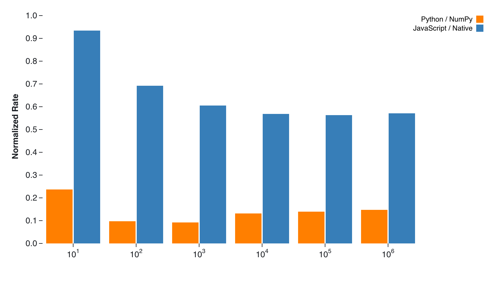
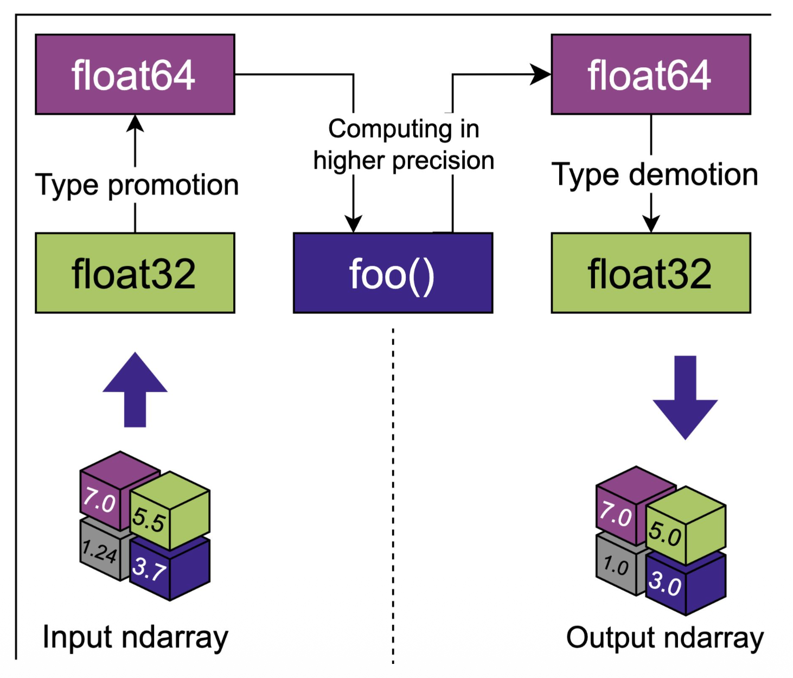
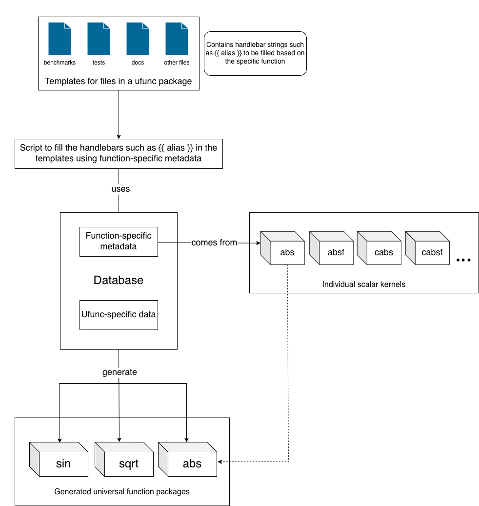

# Automating Universal Function Generation in stdlib

If you've worked with NumPy, you've probably used universal functions (ufuncs) without thinking twice about them. Call `np.sqrt(array)` on a multi-dimensional array, and NumPy handles everything: type dispatch, memory layout, broadcasting, and performance optimization.

NumPy's ufunc machinery, at its core, is a C-level dispatch system that maintains a registry of type-specific implementations for each mathematical operation. When you call `np.abs(x)`, NumPy inspects the input array's dtype, looks up the corresponding C function pointer (say, `fabs` for float64 or `fabsf` for float32), and applies it element-wise using optimized memory access patterns. The system handles type promotion automatically. If you pass an int32 array to `np.sqrt`, NumPy promotes it to float64 because square roots of integers aren't generally integers. Complex numbers get special treatment: `np.abs` on a complex128 array dispatches to a magnitude calculation that returns float64.

This works beautifully in Python's ecosystem. The ufunc system uses vectorization (SIMD instructions), handles memory-mapped arrays efficiently, and integrates well with libraries like SciPy, pandas, and scikit-learn.

## The JavaScript Challenge

Now try to build the same universal function system in JavaScript.

JavaScript has no native concept of typed multi-dimensional arrays. There's no built-in vectorization support. The language doesn't expose SIMD instructions directly (though WebAssembly is changing this). And unlike Python, where NumPy is the de facto standard, the JavaScript ecosystem is fragmented across browsers, Node.js, and various runtime environments.

You can't just port NumPy's C code and call it a day. JavaScript's type system is different. Everything is a `Number` (float64) unless you explicitly use TypedArrays. Memory management is handled by the garbage collector, not manual allocation. And while Node.js native addons let you write C code, you're still bridging two very different runtime environments.

### JavaScript's Performance Advantage

The performance characteristics are fundamentally different between Python and JavaScript ecosystems. In Python, the performance gap between interpreted code and C extensions is massive. Pure Python loops are 100-1000x slower than equivalent C code due to dynamic type checking, interpreted execution, and object creation overhead. This enormous gap makes NumPy's C-only approach essential. There's simply no viable pure Python alternative for numerical computing at scale.

JavaScript's performance profile tells a different story. Modern V8's JIT compiler can optimize well-written JavaScript to achieve performance much closer to native implementations. While crossing the JavaScript/C boundary through N-API introduces measurable overhead, the baseline JavaScript performance is strong enough that the relative gap to native code is significantly smaller than Python's gap to NumPy.

For example, consider the [error function](https://en.wikipedia.org/wiki/Error_function) implementation. The [pure JavaScript version](https://github.com/stdlib-js/stdlib/blob/develop/lib/node_modules/%40stdlib/math/base/special/erf/lib/main.js) uses polynomial approximations and rational functions optimized for V8's JIT compiler. The native addon calls the optimized [C implementation](https://github.com/stdlib-js/stdlib/blob/develop/lib/node_modules/%40stdlib/math/base/special/erf/src/main.c). When we benchmark these implementations against their Python equivalents, a clear pattern emerges: JavaScript gets much closer to native performance than Python does.

The chart below compares how Python and JavaScript perform relative to their respective native implementations. Python running pure interpreted code is dramatically slower than NumPy's C extensions. JavaScript, benefiting from V8's sophisticated JIT compilation, achieves performance much closer to native addons. This smaller performance gap means JavaScript implementations remain viable even without native compilation, while Python absolutely requires NumPy's C extensions for practical numerical computing.

<figure>
  
  <figcaption>
    Figure 1: Relative performance comparison across array sizes (10¹ to 10⁶ elements). The chart shows two metrics: Python relative to NumPy (orange bars) and JavaScript relative to native addons (blue bars), both normalized where 1.0 represents native performance. Across all array sizes, JavaScript maintains 55-93% of native performance, while Python achieves only 8-15% of NumPy's performance. This demonstrates that JavaScript gets significantly closer to native speed than Python does to NumPy, making pure JavaScript implementations more viable for numerical computing than pure Python alternatives.
  </figcaption>
</figure>

### Universal Compatibility Strategy

This performance characteristic drives stdlib's dual implementation strategy. Because JavaScript can achieve reasonable performance without native compilation, we can offer pure JavaScript implementations that work across all environments: browsers, Node.js, Deno, Bun, embedded systems, and edge platforms. They use only standard JavaScript features and stdlib's own mathematical utilities like [`ln`](https://github.com/stdlib-js/stdlib/tree/develop/lib/node_modules/%40stdlib/math/base/special/ln) and [`exp`](https://github.com/stdlib-js/stdlib/tree/develop/lib/node_modules/%40stdlib/math/base/special/exp), ensuring consistent behavior everywhere.

For Node.js users who need maximum performance, the [`native addons`](https://github.com/stdlib-js/stdlib/tree/develop/lib/node_modules/@stdlib/math/base/special) provide optimized C implementations exposed through N-API bindings. The [`binding.gyp`](https://github.com/stdlib-js/stdlib/blob/develop/lib/node_modules/@stdlib/math/base/special/abs/binding.gyp) files configure native compilation, while [`main.c`](https://github.com/stdlib-js/stdlib/tree/develop/lib/node_modules/@stdlib/math/base/special) contains the underlying scalar implementations. But unlike NumPy, where C extensions are mandatory, stdlib's native addons are optional performance enhancements.

This architecture serves both high-performance numerical computing (where native addons provide additional speedups) and general-purpose JavaScript development (where universal compatibility and zero-compilation deployment are essential). Python's ecosystem can't offer this flexibility, as the performance gap is too large to make pure Python viable for numerical work.

## stdlib's Approach

stdlib's ufunc system makes three architectural decisions that diverge from NumPy's approach:

### Dual Implementation Strategy

Every universal function has both a pure JavaScript implementation and an optional native addon. The JavaScript version works everywhere and serves as the default. The native addon provides a performance boost for Node.js users who need it, but it's not required. This is different from NumPy, where the C implementation is the only implementation.

### Decomposable Architecture

Unlike NumPy, which is a monolithic library where ufuncs are tightly integrated into the core, stdlib follows a **decomposable design philosophy**. Every component exists as an independent, composable package that can be used in isolation or combined with others. You can use scalar math functions without ndarrays, or apply array iteration without knowing about type dispatch. Each piece has a clear API and can be tested, versioned, and distributed independently.

### Scalar Kernel Composition

stdlib already has 300+ high-quality scalar implementations for mathematical functions, such as [`abs`](https://github.com/stdlib-js/stdlib/tree/develop/lib/node_modules/%40stdlib/math/base/special/abs), [`sqrt`](https://github.com/stdlib-js/stdlib/tree/develop/lib/node_modules/%40stdlib/math/base/special/sqrt), [`sin`](https://github.com/stdlib-js/stdlib/tree/develop/lib/node_modules/%40stdlib/math/base/special/sin), [`gamma`](https://github.com/stdlib-js/stdlib/tree/develop/lib/node_modules/%40stdlib/math/base/special/gamma), etc., each with variants for different dtypes ([`absf`](https://github.com/stdlib-js/stdlib/tree/develop/lib/node_modules/%40stdlib/math/base/special/absf) for float32, [`cabs`](https://github.com/stdlib-js/stdlib/tree/develop/lib/node_modules/%40stdlib/math/base/special/cabs) for complex128). Universal functions are built by composing these scalar kernels with ndarray iteration machinery, rather than implementing whole of the math from scratch.

This architecture works well for JavaScript. The dual implementation strategy means you're not forcing users to compile native code just to compute square roots. And the scalar kernel approach leverages existing, well-tested mathematical implementations rather than duplicating effort.

## The Building Blocks

This modularity is fundamental to stdlib's architecture. You can use [scalar math functions](https://github.com/stdlib-js/stdlib/tree/develop/lib/node_modules/%40stdlib/math/base/special) without ever touching ndarrays. You can use [ndarray iteration utilities](https://github.com/stdlib-js/stdlib/tree/develop/lib/node_modules/%40stdlib/ndarray/base/unary) to apply any function element-wise without knowing about type dispatch. Each piece has a clear, documented API and can be tested, versioned, and distributed independently.

Building universal functions in this ecosystem requires assembling four key components:

**1. Scalar Kernels** ([`@stdlib/math/base/special/*`](https://github.com/stdlib-js/stdlib/tree/develop/lib/node_modules/%40stdlib/math/base/special))

These are the mathematical implementations that operate on individual scalar values. stdlib has 300+ of these. If we take an example of the absolute value function, it has the following kernels:
- [`abs`](https://github.com/stdlib-js/stdlib/tree/develop/lib/node_modules/%40stdlib/math/base/special/abs) → float64
- [`absf`](https://github.com/stdlib-js/stdlib/tree/develop/lib/node_modules/%40stdlib/math/base/special/absf) → float32
- [`cabs`](https://github.com/stdlib-js/stdlib/tree/develop/lib/node_modules/%40stdlib/math/base/special/cabs) → complex128
- [`cabsf`](https://github.com/stdlib-js/stdlib/tree/develop/lib/node_modules/%40stdlib/math/base/special/cabsf) → complex64
- [`labs`](https://github.com/stdlib-js/stdlib/tree/develop/lib/node_modules/%40stdlib/math/base/special/labs) → int32

Each scalar kernel is a standalone package with its own JavaScript and C implementations, tests, benchmarks, and documentation. They know nothing about ndarrays. They just do math on individual values.

```javascript
import absf from '@stdlib/math/base/special/absf';

const x = -3.14;
const y = absf( x );
// returns 3.14
```

**2. Native Addons**

For performance-critical operations, stdlib provides C implementations that can be called from Node.js through N-API. Each scalar kernel has its own native implementation that can be compiled independently. The native addon for a universal function simply dispatches to the appropriate scalar kernel's native implementation based on the input dtype.

**3. Type Dispatch System** ([`@stdlib/ndarray/dispatch`](https://github.com/stdlib-js/stdlib/tree/develop/lib/node_modules/%40stdlib/ndarray/dispatch))

This is the machinery that maps input dtypes to appropriate scalar kernels. Given an input array of type float32 and a desired output type of float64, the dispatch system looks up which scalar kernel to use and whether type promotion is needed. It's a separate, reusable component that any package can use, not hardcoded into a monolithic ufunc implementation.

**4. ndarray Iteration Utilities** ([`@stdlib/ndarray/base/unary`](https://github.com/stdlib-js/stdlib/tree/develop/lib/node_modules/%40stdlib/ndarray/base/unary))

These handle the mechanics of traversing multi-dimensional arrays efficiently: computing memory offsets, handling strides, dealing with non-contiguous layouts, and applying functions element-wise. Like everything else, these are standalone packages that work with any callback function. They don't know or care what mathematical operation you're performing.

### Building Blocks, Not Monoliths

This decomposable architecture has profound implications for how universal functions are built. In NumPy, a ufunc is a tightly integrated C object that bundles the scalar implementations, type dispatch, and array iteration into a single unit. You can't easily separate these concerns or reuse them independently.

In stdlib, a universal function is a **composition** of independent packages. If we take the absolute value function as an example, its dependency tree looks like this:

```
@stdlib/math/special/abs (universal function)
│
├─ @stdlib/math/tools/unary (ufunc factory)
│  │
│  ├─ @stdlib/ndarray/dispatch (type dispatcher)
│  │  │
│  │  └─ @stdlib/ndarray/base/unary (array iteration)
│  │
│  ├─ types.json (input→output dtype mappings)
│  │
│  ├─ data.js (scalar kernel array)
│  │  ├─ @stdlib/math/base/special/abs (float64)
│  │  ├─ @stdlib/math/base/special/absf (float32)
│  │  ├─ @stdlib/math/base/special/cabs (complex128)
│  │  ├─ @stdlib/math/base/special/cabsf (complex64)
│  │  ├─ @stdlib/math/base/special/labs (int32)
│  │  └─ ... (more scalar kernels)
│  │
│  └─ config.js (policies and dtype families)
```

## The Challenge: Manual Universal Function Creation

To understand why automation was necessary, let's walk through what creating a single universal function would involve. Take `abs` (absolute value) as an example. It seems simple, but the implementation details are extensive.

The complexity starts with the type system. The `abs` function supports 59 different input→output type combinations, each following stdlib's [`mostly-safe-casts`](https://github.com/stdlib-js/stdlib/tree/develop/lib/node_modules/%40stdlib/ndarray/mostly-safe-casts) promotion rules. These rules balance type safety with practical flexibility. Safe Casts preserve data without loss, while floating-point types can downcast with precision loss when mathematically reasonable. The system prevents spurious conversions that would produce mathematically incorrect results, like casting `float32` to `int32`.

The mostly-safe-cast system defines how input types can be promoted to higher precision types for computation:

| **from ↓ \ to →** | **i1** | **i2** | **i4** | **i8** | **u1** | **u2** | **u4** | **u8** | **f2** | **f4** | **f8** | **c4** | **c8** | **c16** | **b** | **g** |
|---|---|---|---|---|---|---|---|---|---|---|---|---|---|---|---|---|
| **i1** | i1 | i2 | i4 | i8 | - | - | - | - | f2 | f4 | f8 | c4 | c8 | c16 | - | g |
| **i2** | - | i2 | i4 | i8 | - | - | - | - | - | f4 | f8 | - | c8 | c16 | - | g |
| **i4** | - | - | i4 | i8 | - | - | - | - | - | - | f8 | - | - | c16 | - | g |
| **i8** | - | - | - | i8 | - | - | - | - | - | - | - | - | - | - | - | g |
| **u1** | - | i2 | i4 | i8 | u1 | u2 | u4 | u8 | f2 | f4 | f8 | c4 | c8 | c16 | - | g |
| **u2** | - | - | i4 | i8 | - | u2 | u4 | u8 | - | f4 | f8 | - | c8 | c16 | - | g |
| **u4** | - | - | - | i8 | - | - | u4 | u8 | - | - | f8 | - | - | c16 | - | g |
| **u8** | - | - | - | - | - | - | - | u8 | - | - | - | - | - | - | - | g |
| **f2** | - | - | - | - | - | - | - | - | f2 | f4 | f8 | c4 | c8 | c16 | - | g |
| **f4** | - | - | - | - | - | - | - | - | f2 | f4 | f8 | c4 | c8 | c16 | - | g |
| **f8** | - | - | - | - | - | - | - | - | f2 | f4 | f8 | c4 | c8 | c16 | - | g |
| **c4** | - | - | - | - | - | - | - | - | - | - | - | c4 | c8 | c16 | - | g |
| **c8** | - | - | - | - | - | - | - | - | - | - | - | c4 | c8 | c16 | - | g |
| **c16** | - | - | - | - | - | - | - | - | - | - | - | c4 | c8 | c16 | - | g |
| **b** | - | - | - | - | - | - | - | - | - | - | - | - | - | - | b | g |
| **g** | - | - | - | - | - | - | - | - | - | - | - | - | - | - | - | g |

**Key:**
- **i1** = int8
- **i2** = int16
- **i4** = int32
- **i8** = int64
- **u1** = uint8
- **u2** = uint16
- **u4** = uint32
- **u8** = uint64
- **f2** = float16
- **f4** = float32
- **f8** = float64
- **c4** = complex32
- **c8** = complex64
- **c16** = complex128
- **b** = bool
- **g** = generic

Real types can be promoted to complex types (with the imaginary part set to zero), but complex types cannot be cast to real types. This prevents unsafe operations like discarding the imaginary component without explicit user intent.

This approach contrasts sharply with NumPy's polymorphic functions. Where NumPy might have a single `np.abs` that handles everything through runtime type dispatch, stdlib maintains distinct scalar kernels with specific type signatures. Behind the scenes, you won't find a single polymorphic absolute value function. Instead, you have `abs` for float64, `absf` for float32, `cabs` for complex128, `cabsf` for complex64, and `labs` for int32. Each kernel knows exactly what type it expects and what type it returns, eliminating runtime type checking overhead and enabling the JavaScript JIT compiler to generate optimized machine code.

But here's the key insight: users never need to think about this complexity. Whether you're working with float32 arrays, complex numbers, or generic data, you simply call `abs(x)` and the universal function automatically selects the optimal kernel. The type dispatch happens transparently, giving you both the performance benefits of specialized implementations and the simplicity of a single, unified interface.

The type matrix reveals the mathematical logic behind the system. Complex types always produce real outputs since absolute value computes magnitude. Smaller integer types have more promotion options than larger ones. Floating-point types can downcast when precision loss is acceptable. Unsigned integers can promote to signed integers of sufficient width. Generic arrays serve as the universal fallback, accepting any JavaScript value while providing a consistent interface for mathematical operations.

The dual implementation strategy becomes particularly important when dealing with generic ndarrays. Generic arrays can contain arbitrary JavaScript objects such as strings, custom objects, or even functions. While JavaScript implementations can gracefully handle these cases through the accessor protocol, C implementations hit a fundamental wall. Every element access would require unboxing JavaScript values, converting them to C types for computation, then boxing the results back. This marshaling overhead completely defeats the performance benefits of native code. The JavaScript implementation, however, can process generic arrays efficiently using optimized accessor functions that the JIT compiler can inline and optimize.

Creating these type mappings manually would require writing a flat array where every pair of entries represents an input type and its corresponding output type. For the 59 combinations in `abs`, this means carefully enumerating each valid transformation while ensuring mathematical correctness. Complex inputs need special handling: not through generic type promotion, but through dedicated scalar kernels that understand the mathematical relationship between complex inputs and real outputs.

Here's what that manual enumeration of input→output dtype pairs would look like:

```
// float64 input
float64 → float64
float64 → generic

// float32 input
float32 → float32
float32 → float64
float32 → generic

// int32 input
int32 → int32
int32 → uint32
int32 → float64
int32 → generic

// ... more combinations for int16, int8, uint32, uint16, uint8, uint8c
```

This approach enables efficient runtime dispatch. The system computes an index into [this array](https://github.com/stdlib-js/stdlib/blob/develop/lib/node_modules/%40stdlib/math/special/abs/lib/types.js) array based on the input and output dtypes, then uses that same index to look up the appropriate scalar kernel in a [strided array](https://github.com/stdlib-js/stdlib/blob/develop/lib/node_modules/%40stdlib/math/special/abs/lib/data.js). This eliminates complex branching logic during the hot loop of array processing.

Next, you'd create the native C addon that bridges JavaScript and the scalar implementations. This involves mapping each type combination to the appropriate scalar function, whether that's `stdlib_base_abs` for float64, `stdlib_base_absf` for float32, `stdlib_base_cabs` for complex128, or `stdlib_base_labs` for int32. The challenge is ensuring every one of those 59 type combinations has the correct C function pointer.

Here's how that mapping would look in the [native addon](https://github.com/stdlib-js/stdlib/blob/develop/lib/node_modules/%40stdlib/math/special/abs/src/addon.c):

```c
// Map each type combination to the right scalar function
static void *data[] = {
    // float64
    (void *)stdlib_base_abs, // for float64→float64

    // float32
    (void *)stdlib_base_absf, // for float32→float32
    (void *)stdlib_base_absf, // for float32→float64

    // int32
    (void *)stdlib_base_labs, // for int32→int32
    (void *)stdlib_base_labs, // for int32→uint32
    (void *)stdlib_base_labs, // for int32→float64

    // ... mappings for all other types
};
```

Note that generic arrays (which can contain arbitrary JavaScript objects) are not handled by the C addon. Type combinations like `float64→generic` or `generic→generic` fall back to pure JavaScript implementations, so they don't appear in this C function pointer array.

### Type Promotion and Demotion

The native addon generation handles the complexity of type promotion and demotion. When no direct kernel exists for a specific input-output type combination, the system creates intermediate functions like `stdlib_ndarray_f_f_as_d_d`. This name uses a form of Hungarian notation to encode the type transformation: a float32 (`f`) input gets promoted to float64 (`d`) for computation, then the result is demoted back to float32 (`f`) for the output array. This approach ensures mathematical accuracy by computing at higher precision while maintaining the expected output type.

This type promotion and demotion process is visualized below, showing how the system handles cases where no direct kernel exists for a specific input-output combination:

<div align="center">
  
  <p><strong>Figure 9:</strong> Type promotion and demotion process. When no direct float32→float32 kernel exists for a mathematical operation, the system promotes the input to float64 for higher precision computation, then demotes the result back to the original output type.</p>
</div>


The beauty of this approach is that it happens automatically. Users don't need to understand the intricate type promotion rules or worry about whether a direct kernel exists for their specific dtype combination or not.

### Policies and Constraints

The [`config.js`](https://github.com/stdlib-js/stdlib/blob/develop/lib/node_modules/%40stdlib/math/special/abs/lib/config.js) file defines the function's policies and constraints. It specifies which dtype families the function supports, the number of input and output arrays, and casting policies. These policies determine how the function behaves when faced with input arrays that don't have direct kernel implementations.

Here's the configuration for the `abs` function:

```javascript
const config = {
    // Total number of ndarray arguments:
    nargs: 2,

    // Number of input ndarray arguments:
    'nin': 1,

    // Number of output ndarray arguments:
    'nout': 1,

    // List of supported input ndarray data types:
    'idtypes': dtypes( 'numeric_and_generic' ),

    // List of supported output ndarray data types:
    'odtypes': dtypes( 'real_and_generic' ),

    // Dispatch policies:
    'policies': {
        // Output data type policy:
        'output': 'real_and_generic',

        // Input ndarray casting policy:
        'casting': 'none'
    }
};
```

The key insight is that `abs` accepts any numeric type (including generic arrays) as input, but only produces real numbers or generic outputs. Complex inputs are handled by dedicated kernels that compute the magnitude, while unsigned integer types use identity functions since their absolute value is the number itself.

The automation challenge comes from generating the universal function wrappers for all these mathematical functions. Each wrapper needs type mapping matrices encoding the 59 input-output dtype combinations, for example, in the case of `abs`, scalar kernel mappings that route each combination to the appropriate implementation, configuration policies that specify supported dtypes and casting rules, native addon bindings with N-API code to bridge JavaScript and C implementations, plus comprehensive documentation and tests ensuring the universal function behaves correctly across all supported types.

## The Database System

The breakthrough came from recognizing that all this manual work followed predictable patterns. Rather than having to copy-paste code between packages, we needed a systematic way to capture the essential metadata that drives universal function generation, and then automate the generation process based on that metadata.

### Systematic Metadata Management

We realized that universal function generation is fundamentally a metadata management problem. We needed two types of information, each requiring different curation approaches:

**Mathematical specifications** change rarely but require human judgment. Should `abs` support complex numbers? How should `sqrt` handle negative inputs? These decisions need mathematical expertise and careful consideration of edge cases.

**Implementation details** change frequently but follow predictable patterns. Function signatures, parameter names, example values - these update automatically as scalar packages evolve. Manually tracking these across 100+ functions was the source of our inconsistencies.

We solved this by splitting the metadata into two databases that work together during generation.

#### 1. Function Database: Mathematical Specifications

The [function database](https://github.com/stdlib-js/stdlib/blob/develop/lib/node_modules/%40stdlib/math/special/data/unary_function_database.json) contains the authoritative specifications for each mathematical function. Here's the entry for absolute value:

```
{
  "abs": { // Base function name
    "input_dtypes": "numeric_and_generic", // Accepts any numeric type plus generic JavaScript objects
    "output_dtypes": "real_and_generic", // Produces real numbers or generic outputs
    "excluded_dtypes": [ // Skip generation for these dtypes
      "float16",
      "int64",
      "uint64",
      "uint8c",
      "complex32"
    ],
    "primary_dtype": "float64", // Primary dtype for testing and documentation
    "scalar_kernels": { // Scalar kernels for each dtype
      "int32": "@stdlib/math/base/special/labs",
      "uint8": "@stdlib/number/uint8/base/identity",
      "uint16": "@stdlib/number/uint16/base/identity",
      "uint32": "@stdlib/number/uint32/base/identity",
      "float32": "@stdlib/math/base/special/absf",
      "float64": "@stdlib/math/base/special/abs",
      "complex64": "@stdlib/math/base/special/cabsf",
      "complex128": "@stdlib/math/base/special/cabs",
      "generic": "@stdlib/math/base/special/abs"
    },
    "policies": { // Dispatch policies
      "output": "real_and_generic", // Output dtype policy
      "casting": "none" // Input ndarray casting policy
    }
  }
}
```

Each field drives specific aspects of universal function generation. The `input_dtypes` and `output_dtypes` fields define the mathematical boundaries. For `abs`, `numeric_and_generic` means it accepts any numeric type plus generic JavaScript objects, while `real_and_generic` restricts outputs to real numbers since absolute value of complex numbers produces real magnitudes. These policies interface with the mostly-safe-casts system to automatically generate the 59-entry type mapping matrix we saw earlier.

The `scalar_kernels` mapping is where the mathematical rubber meets the implementation road. Each entry points to the specific scalar function that knows how to compute the operation for that dtype. Notice how `uint8`, `uint16`, and `uint32` use identity functions rather than actual absolute value computations. These unsigned types are already non-negative, so the mathematical operation simplifies to just returning the input unchanged.

The `excluded_dtypes` field provides fine-grained control over which types to skip during generation. Some functions don't make mathematical sense for certain dtypes, or we may not have implemented kernels for all dtypes yet, such as for `float16`.

#### 2. Package Database: Implementation Details

The [package database](https://github.com/stdlib-js/stdlib/blob/develop/lib/node_modules/%40stdlib/math/special/data/unary.json) contains granular metadata extracted from individual scalar packages. Here's the entry for the `absf` (single-precision absolute value) kernel:

```
{
  "@stdlib/math/base/special/abs": { // Package path (key for lookup)
    "$schema": "math/base@v1.0", // Schema version for validation
    "base_alias": "abs", // Base function name for grouping
    "alias": "abs", // Specific function alias
    "pkg_desc": "compute the absolute value", // Package description
    "desc": "computes the absolute value", // Function description
    "short_desc": "absolute value", // Short description for documentation
    "parameters": [ // Function parameters
      {
        "name": "x", // Parameter name
        "desc": "input value", // Parameter description
        "type": { // Cross-language type mapping
          "javascript": "number",
          "jsdoc": "number",
          "c": "double",
          "dtype": "float64"
        },
        "domain": [ // Mathematical domain
          {
            "min": "-infinity",
            "max": "infinity"
          }
        ],
        "rand": { // Random value generation for tests
          "prng": "random/base/uniform", // PRNG to use
          "parameters": [ // PRNG parameters
            -10, // Min value
            10 // Max value
          ]
        },
        "example_values": [ // Example values for documentation
          64,
          27,
          0,
          0.1,
          -9,
          8,
          -1,
          125,
          -10.2,
          11.3,
          -12.4,
          3.5,
          -1.6,
          15.7,
          -16,
          17.9,
          -188,
          19.11,
          -200,
          21.15
        ]
      }
    ],
    "returns": { // Return value specification
      "desc": "absolute value", // Return value description
      "type": { // Cross-language return type mapping
        "javascript": "number",
        "jsdoc": "number",
        "c": "double",
        "dtype": "float64"
      }
    },
    "keywords": [ // NPM package keywords
      "abs",
      "absolute",
      "magnitude"
    ],
    "extra_keywords": [ // Additional search keywords
      "math.abs"
    ]
  }
}
```

This database is automatically generated by scraping metadata from individual scalar packages.

### How the Databases Work Together

The generation process orchestrates both databases into a systematic pipeline. When generating a universal function like `abs`, the system first queries the function database to understand what the function needs to support. It discovers that the function should accept all numeric dtypes plus generic arrays as input, and produce real-number or generic outputs. The database also provides the scalar kernel mappings, indicating that `float32` arrays should use the `absf` kernel, `float64` arrays should use `abs`, and so on.

Next, the system queries the package database for each kernel's implementation details. For the `absf` kernel, it retrieves the exact parameter specifications (a single parameter `x` of type `number` in JavaScript and `float` in C) and the return type (also `number` in JavaScript and `float` in C).

With both queries complete, the system generates the complete universal function package. The type dispatch logic maps `float32` input arrays to the `absf` kernel, the native binding creates a C function signature `float stdlib_ndarray_f_f( float x )`, documentation pulls parameter descriptions and return types directly from the package metadata, and test cases use the `example_values` array to ensure comprehensive coverage. This same systematic process repeats for each dtype - when the system encounters `int32`, it queries the function database for the `labs` mapping, retrieves implementation details from the package database, and generates the corresponding universal function variant with the same precision and consistency.

## From Database to Working Code

The database provides the metadata, but the real magic happens in the code generation phase. This is where database entries are transformed into complete, production-ready universal function packages.

<figure>
  
  <figcaption>
    Figure 2: The generation pipeline. Templates for benchmarks, tests, documentation, and other files are copied while generating a ufunc. Handlebar placeholders like {{ alias }} are filled with function-specific data from the database. A script orchestrates this process, reading metadata and producing complete universal function packages for functions like sin, sqrt, and abs.
  </figcaption>
</figure>

The generation system uses a sophisticated template-based approach that can create all the necessary files for a universal function package from a single database entry. The system starts by gathering template files for all the components a universal function package needs: benchmarks, tests, documentation, and source code. These templates contain handlebar placeholders like `{{ alias }}`, `{{ description }}`, and `{{ example_values }}` that will be replaced with function-specific data. For each function being generated (like `abs`), the system queries both databases to gather the necessary metadata. The function database provides the mathematical specification: which dtypes to support, which scalar kernels to use, and what policies apply. The package database provides the implementation details: parameter descriptions, return types, example values, and other metadata extracted from the scalar packages. A generation script then reads the templates and database entries, filling in all the handlebar placeholders with function-specific data. For `abs`, it replaces `{{ alias }}` with `abs`, `{{ description }}` with the function description, and `{{ example_values }}` with the concrete test values from the package database. This process repeats for each template file, producing a complete universal function package with benchmarks, tests, documentation, and native bindings all tailored to the specific function.

The generation process involves several key components working together: the universal function factory that creates the runtime behavior, the type system that handles all the complex mappings, and the native bindings that provide optimal performance.

Each generated package contains a complete structure:

```
@stdlib/math/special/abs/
├── README.md
├── binding.gyp
├── include.gypi
├── manifest.json
├── package.json
├── benchmark/
│   ├── benchmark.1d_contiguous.js
│   ├── benchmark.1d_contiguous.native.js
│   ├── benchmark.1d_contiguous_assign.js
│   ├── benchmark.1d_contiguous_assign.native.js
│   ├── benchmark.nd_contiguous.js
│   ├── benchmark.nd_contiguous.native.js
│   ├── benchmark.nd_noncontiguous.js
│   ├── benchmark.nd_noncontiguous.native.js
│   ├── benchmark.nd_singleton_dims.js
│   ├── benchmark.nd_singleton_dims.native.js
├── docs/
│   ├── repl.txt
│   └── types/
│       └── index.d.ts
├── examples/
│   └── index.js
├── lib/
│   ├── config.js
│   ├── data.js
│   ├── index.js
│   ├── main.js
│   ├── native.js
│   ├── types.js
│   └── types.json
├── scripts/
│   └── types.js
├── src/
│   ├── Makefile
│   └── addon.c
└── test/
    ├── test.assign.js
    ├── test.assign.native.js
    ├── test.js
    ├── test.main.js
    └── test.main.native.js
```

## Conclusion

The automation system transforms a single database entry into a complete universal function package with the full stdlib structure consisting of native C bindings and comprehensive benchmarks, along with type definitions and documentation. When new data types like `float16` need support, updating the function database once will automatically propagate across all 59 type combinations, eliminating the manual inconsistencies that would otherwise plague such implementations.

GitHub workflows monitor for database changes, scalar package updates, or generation script modifications, creating pull requests that maintain human review while ensuring improvements flow automatically from scalar kernels to universal functions. The [update_math_scaffold_databases workflow](https://github.com/stdlib-js/stdlib/blob/develop/.github/workflows/update_math_scaffold_databases.yml) runs whenever the function database or any scalar package metadata changes, automatically updating the package database and proposing pull requests for review.

## Acknowledgments

This project wouldn't have been possible without the guidance and support of my mentor, [Athan Reines](https://github.com/kgryte). When I started, the natural approach would have been to manually create universal functions one by one, which would have been the usual repetitive work. Instead, Athan encouraged me to focus on building the automation infrastructure, which turned out to be far more impactful.

The technical complexity of stdlib's type system was initially overwhelming. Through extensive pair programming sessions, Athan walked me through the entire process: how dtype mappings work, the intricate promotion rules (like complex128→float64 for abs), and the logic behind every type combination. This was invaluable in understanding not just what to implement, but why each piece was necessary.

One of the key breakthroughs came when Athan suggested using the function databases. This idea became the foundation of our two-database architecture: using [`unary_function_database.json`](https://github.com/stdlib-js/stdlib/tree/develop/lib/node_modules/%40stdlib/math/special/data/unary_function_database.json) as the source of truth and generating the detailed [`unary.json`](https://github.com/stdlib-js/stdlib/tree/develop/lib/node_modules/%40stdlib/math/special/data/unary.json) for scaffolding.

I'm also grateful to everyone at Quansight for providing the opportunity to work on such an impactful open-source project and learn from one of the best in the field.
