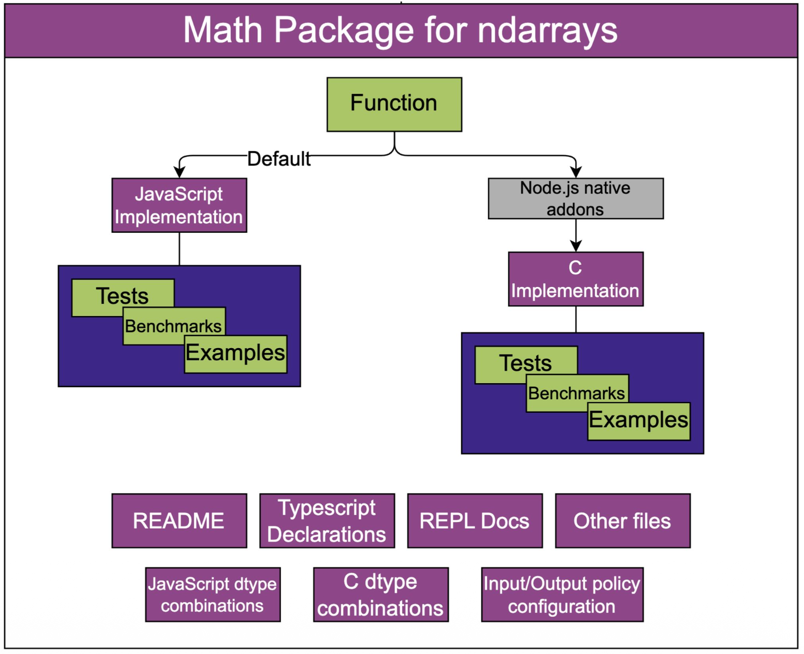
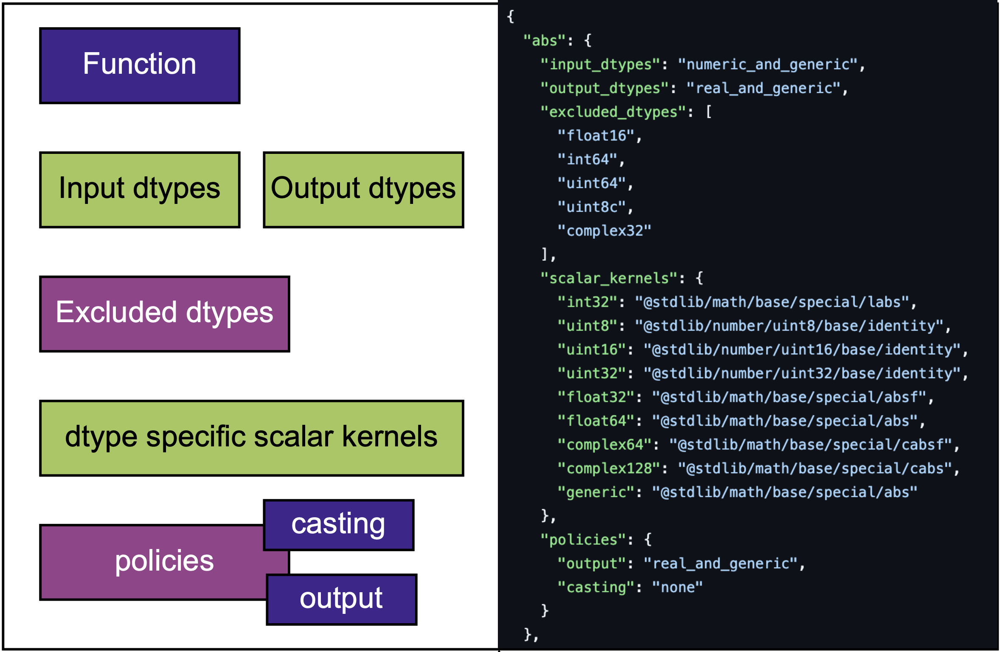
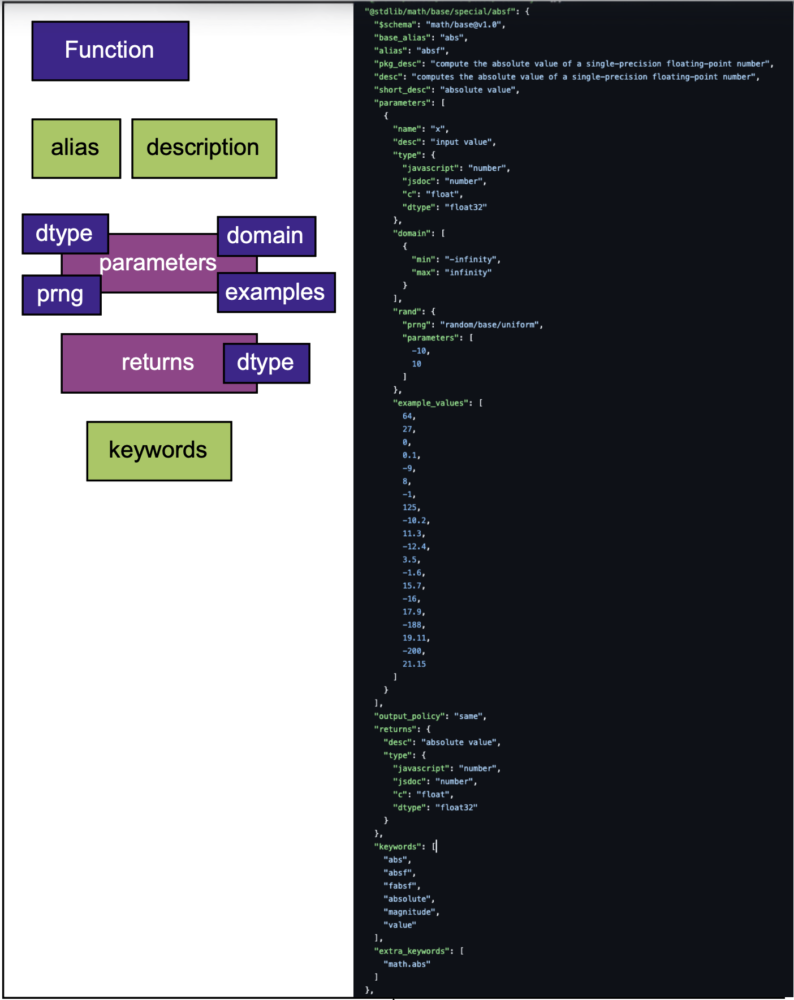
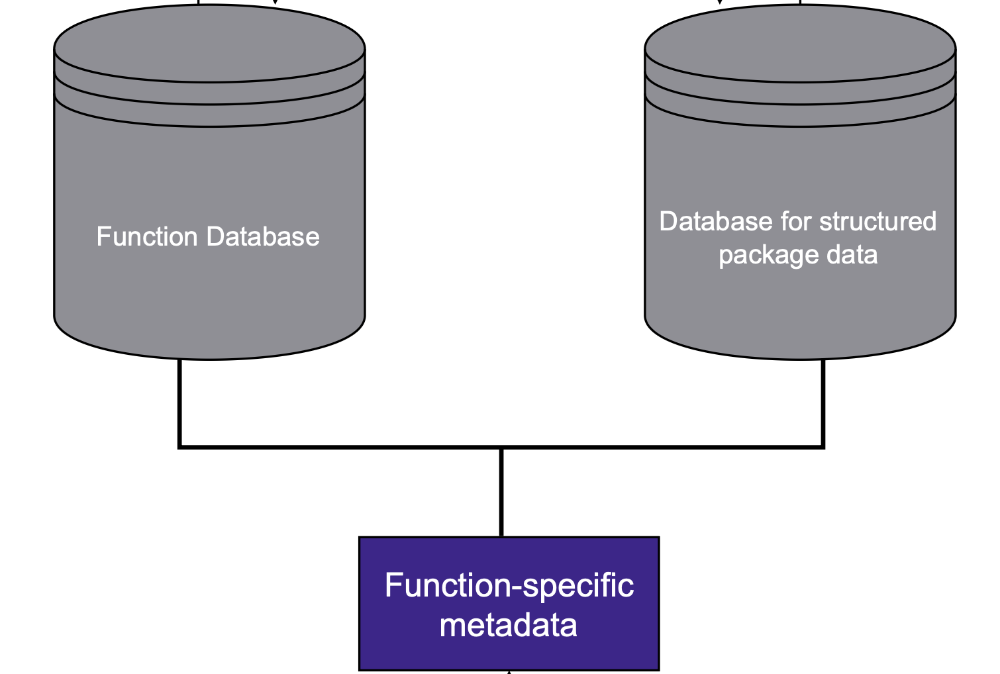
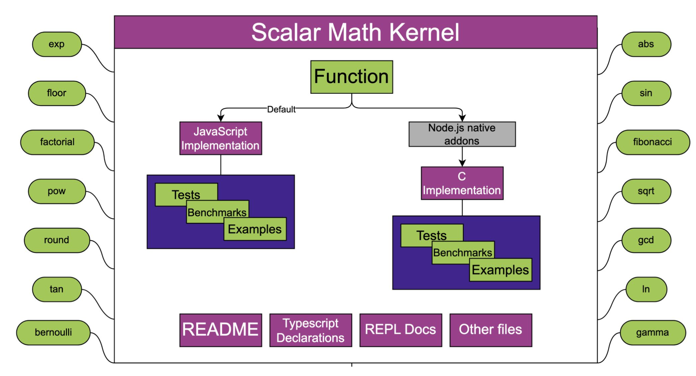
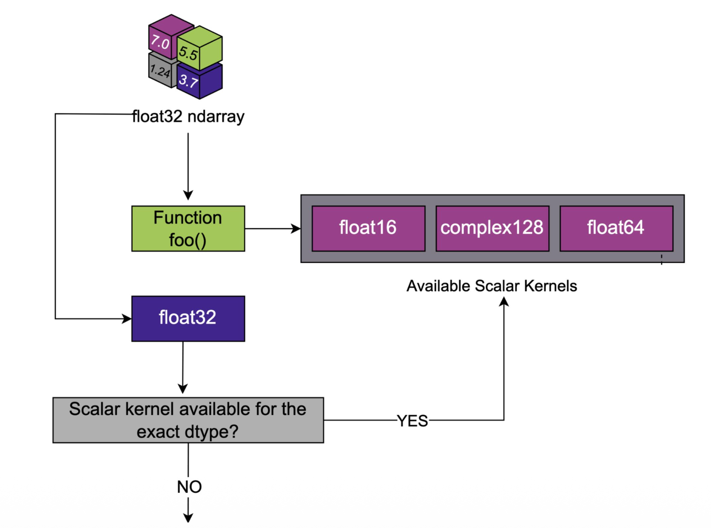
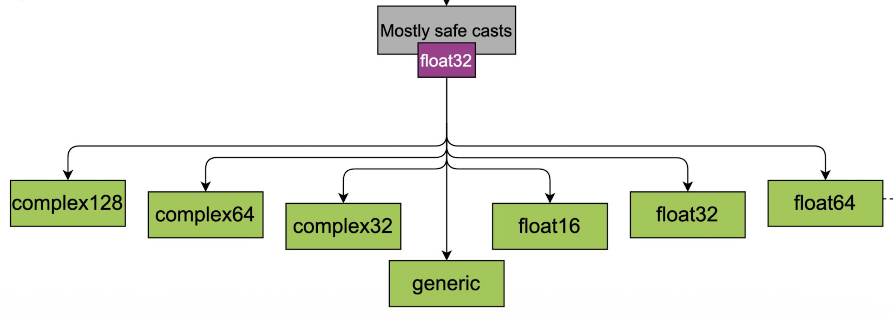
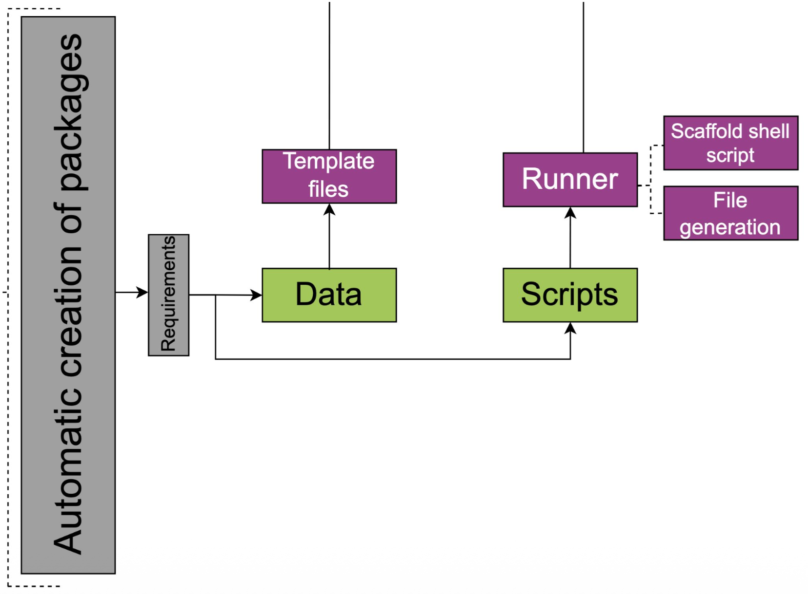

# Automating Universal Function Generation in stdlib

When I looked at stdlib's special math functions, I noticed a gap: we had hundreds of high-quality scalar implementations for functions like [`abs`](https://github.com/stdlib-js/stdlib/tree/develop/lib/node_modules/%40stdlib/math/base/special/abs), [`sqrt`](https://github.com/stdlib-js/stdlib/tree/develop/lib/node_modules/%40stdlib/math/base/special/sqrt), [`sin`](https://github.com/stdlib-js/stdlib/tree/develop/lib/node_modules/%40stdlib/math/base/special/sin), [`cos`](https://github.com/stdlib-js/stdlib/tree/develop/lib/node_modules/%40stdlib/math/base/special/cos), [`exp`](https://github.com/stdlib-js/stdlib/tree/develop/lib/node_modules/%40stdlib/math/base/special/exp), [`log`](https://github.com/stdlib-js/stdlib/tree/develop/lib/node_modules/%40stdlib/math/base/special/ln), each carefully optimized for different data types (such as [`sinf`](https://github.com/stdlib-js/stdlib/tree/develop/lib/node_modules/%40stdlib/math/base/special/sinf) for `float32`, [`labs`](https://github.com/stdlib-js/stdlib/tree/develop/lib/node_modules/%40stdlib/math/base/special/labs) for `int32`, etc.). But these only worked on individual scalar numbers. If you wanted to compute the square root of an entire array, you were out of luck.

````javascript
// Scalar implementation - works on individual numbers
var sqrt = require( '@stdlib/math/base/special/sqrt' );

var result = sqrt( 4.0 );
// returns 2.0

// But for arrays, you'd need manual loops:
var x = [ 1.0, 4.0, 9.0, 16.0 ];
var y = [];
for ( var i = 0; i < x.length; i++ ) {
    y[ i ] = sqrt( x[ i ] );
}
// y => [ 1.0, 2.0, 3.0, 4.0 ]
````

The scalar functions were already there. [`@stdlib/math/base/special/abs`](https://github.com/stdlib-js/stdlib/tree/develop/lib/node_modules/%40stdlib/math/base/special/abs) could handle a single float64. [`@stdlib/math/base/special/absf`](https://github.com/stdlib-js/stdlib/tree/develop/lib/node_modules/%40stdlib/math/base/special/absf) was optimized for float32. [`@stdlib/math/base/special/cabs`](https://github.com/stdlib-js/stdlib/tree/develop/lib/node_modules/%40stdlib/math/base/special/cabs) worked with complex numbers. The mathematical heavy lifting was done.

What was missing were universal functions: the ndarray-aware versions that could take these scalar implementations and apply them element-wise across multi-dimensional arrays, handling all the type promotion, memory management, and performance optimization automatically.

Creating them manually would be a massive undertaking. Each universal function would need:

- **Type mapping arrays** defining every valid input→output combination:
  ````javascript
  var types = [
      dtypes.float32.enum, dtypes.float32.enum,
      dtypes.float32.enum, dtypes.float64.enum,
      dtypes.float64.enum, dtypes.float64.enum,
      dtypes.int32.enum, dtypes.int32.enum,
      dtypes.int32.enum, dtypes.uint32.enum,
      dtypes.complex128.enum, dtypes.float64.enum,
      // ... more type combinations
  ];
  ````

- **Native C bindings** that dispatch to the right scalar implementation:
  ````c
  static void *data[] = {
      // float64 (1)
      (void *)stdlib_base_abs,

      // float32 (2)
      (void *)stdlib_base_absf,
      (void *)stdlib_base_absf,

      // int32 (3)
      (void *)stdlib_base_labs,
      (void *)stdlib_base_labs,
      // ... callbacks for each type combination
  };
  ````

- **TypeScript definitions** covering all the type combinations:
  ````typescript
  interface UnaryFunction {
      ( x: InputArray, options?: Options ): typedndarray<number>;
      assign<T extends OutputArray = OutputArray>( x: InputArray, y: T ): T;
  }
  declare var abs: UnaryFunction;
  ````

- **Comprehensive test suites** ensuring correctness across all supported types:
  ````javascript
  tape( 'the function computes the absolute value for each element in an ndarray', function test( t ) {
      var expected;
      var x;
      var y;

      x = uniform( [ 5, 5 ], -10.0, 10.0, {
          'dtype': 'float64'
      });
      y = abs( x );

      expected = map( x, naryFunction( base, 1 ) );
      t.deepEqual( ndarray2array( y ), ndarray2array( expected ), 'returns expected value' );

      t.deepEqual( getShape( y ), getShape( x ), 'returns expected value' );
      t.strictEqual( getOrder( y ), getOrder( x ), 'returns expected value' );

      t.end();
  });
  ````

- **Documentation** following stdlib's conventions:
  ````markdown
  ## Usage

  ```javascript
  var abs = require( '@stdlib/math/special/abs' );
  ```

  #### abs( x[, options] )

  Computes the [absolute value][@stdlib/math/base/special/abs] for each element in an [ndarray][@stdlib/ndarray/ctor].
  ````

- **Integration** with the broader ndarray ecosystem:
  ````javascript
  var dispatch = require( '@stdlib/ndarray/dispatch' );
  var ufunc = require( '@stdlib/math/tools/unary' );
  var unary = require( '@stdlib/ndarray/base/unary' );
  var data = require( './data.js' );
  var types = require( './types.json' );
  var config = require( './config.js' );

  var abs = ufunc( dispatch( unary, types, data, config.nargs, config.nin, config.nout ), [ config.idtypes ], config.odtypes, config.policies );
  ````

The patterns were obvious. Every universal function would follow the same structure. Majorly, only the underlying scalar function and supported types would change. The boilerplate would be nearly identical across dozens of functions.

But the manual approach would be a nightmare. We're talking about 100+ mathematical functions, each requiring hundreds of lines of carefully coordinated code. One mistake in the type mappings, and you get runtime errors. Miss a TypeScript definition, and the types don't work. Forget to update the documentation template, and the docs are inconsistent.

So instead of doing it manually, I worked on building an infrastructure to automate the whole thing.

But first, let's understand what we're actually trying to build. Universal functions are the bridge between individual mathematical operations and efficient array processing,and they're more complex than they might seem at first glance.

## What Are Universal Functions?

<figure>
  
  <figcaption>
    Figure 2: Structure of a universal function package in stdlib, showing the dual implementation approach with JavaScript as default and Node.js native addons for performance, along with comprehensive testing, documentation, and type system components.
  </figcaption>
</figure>

Universal functions (ufuncs) are stdlib's solution to this problem. They're the bridge between scalar mathematical operations and efficient ndarray processing. A universal function takes a scalar implementation and wraps it in all the machinery needed to work with ndarrays.

The challenge is that each universal function is a complex piece of software. It needs to understand dozens of type combinations, dispatch to the right scalar implementation, handle edge cases, and integrate seamlessly with stdlib's broader ecosystem.

Consider what happens when you call `sqrt(x)` on an ndarray:

1. **Input validation**: Is `x` actually an ndarray? What's its data type?
2. **Type dispatch**: For float64, use [`@stdlib/math/base/special/sqrt`](https://github.com/stdlib-js/stdlib/tree/develop/lib/node_modules/%40stdlib/math/base/special/sqrt). For float32, use [`@stdlib/math/base/special/sqrtf`](https://github.com/stdlib-js/stdlib/tree/develop/lib/node_modules/%40stdlib/math/base/special/sqrtf). For complex numbers, use [`@stdlib/math/base/special/csqrt`](https://github.com/stdlib-js/stdlib/tree/develop/lib/node_modules/%40stdlib/math/base/special/csqrt).
3. **Output allocation**: Create a new ndarray with the appropriate output type and shape
4. **Element-wise computation**: Apply the scalar function to every element

All of this complexity is hidden behind a simple, consistent API.

Now that we understand what universal functions do, let's examine what it would take to create them manually, and why that approach would have been unsustainable at scale.

## The Challenge: Manual Universal Function Creation

To understand why automation was necessary, let's walk through what creating a single universal function would involve. Take `abs` (absolute value) as an example. It seems simple, but the implementation details are extensive.

### Step 1: Analyze Type Requirements

First, you'd need to figure out all the valid type combinations. The `abs` function actually supports 59 different input→output type combinations, organized in this type promotion matrix:

```
Input Type    │ Output Types
──────────────┼─────────────────────────────────────────────────────────────────
float64       │ float64, generic
float32       │ float32, float64, generic
complex128    │ float64, generic
complex64     │ float32, float64, generic
int32         │ int32, uint32, float64, generic
int16         │ int16, int32, uint16, uint32, float32, float64, generic
int8          │ int8, int16, int32, uint8, uint8c, uint16, uint32, float32, float64, generic
uint32        │ uint32, float64, generic
uint16        │ int32, uint16, uint32, float32, float64, generic
uint8         │ int16, int32, uint8, uint8c, uint16, uint32, float32, float64, generic
uint8c        │ int16, int32, uint8, uint8c, uint16, uint32, float32, float64, generic
generic       │ generic
```

This matrix is generated using stdlib's **mostly-safe-casts** system, which defines type promotion rules that balance safety with flexibility:

**Mostly-Safe-Casts Rules:**
- **Safe casts**: No data loss (e.g., `int8` → `int16`, `float32` → `float64`)
- **Precision-losing downcasts**: Allowed for floating-point types (e.g., `float64` → `float32`)
- **Complex promotion**: Real types can promote to complex, but not vice versa
- **Generic compatibility**: All types can cast to `generic`, `generic` only to itself

**Key patterns in the type matrix:**
- **Complex types** always produce real outputs (absolute value/magnitude)
- **Smaller integer types** have more promotion options than larger ones
- **Floating-point types** can downcast (precision loss allowed)
- **Unsigned integers** can promote to signed integers of sufficient width

The scaffold system automatically generates these 59 combinations by calling `mostlySafeCasts(inputDtype)` for each input type, then filtering by the function's output policy (`real_and_generic` for `abs`). Here's the actual implementation:

```javascript
// From @stdlib/_tools/scaffold/math-special-unary/scripts/script.js
var mostlySafeCasts = require( '@stdlib/ndarray/mostly-safe-casts' );

// Generate all mostly-safe cast combinations:
for ( i = 0; i < idt.length; i++ ) {
    inputDtype = idt[ i ];

    if ( inputDtype === 'generic' ) {
        allowedCasts = [ 'generic' ];
    } else {
        // Get all dtypes this input can be mostly-safely cast to:
        allowedCasts = mostlySafeCasts( inputDtype );
        /*
        * For complex64 input:
        * allowedCasts = [
        *     'complex64',
        *     'complex128',
        *     'generic'
        * ]
        */
    }

    // Remove dtypes not allowed by output policy (e.g., 'real_and_generic'):
    // For abs function, this filters complex64 → [complex64, complex128, generic]
    // down to just [generic], since only real types are allowed as output
    filtered = [];
    for ( k = 0; k < allowedCasts.length; k++ ) {
        if ( odt.indexOf( allowedCasts[ k ] ) !== -1 ) {
            filtered.push( allowedCasts[ k ] );
        }
    }
    allowedCasts = filtered;

    // However, the abs function has special scalar kernels for complex inputs:
    // complex64 → cabsf (outputs float32), complex128 → cabs (outputs float64)
    // So additional mappings are created based on the scalar kernel's natural output type

    // Generate mappings for each valid input→output combination
    for ( j = 0; j < allowedCasts.length; j++ ) {
        outputDtype = allowedCasts[ j ];
        // Create type mapping entry...
    }
}
```

This ensures comprehensive type coverage while maintaining mathematical correctness.

### Step 2: Create Type Mapping Arrays

Then you'd write the type mapping array by hand, i.e., a flat array where every pair of entries represents an input type and its corresponding output type:

```javascript
var types = [
    // float64 input
    dtypes.float64.enum, dtypes.float64.enum,
    dtypes.float64.enum, dtypes.generic.enum,

    // float32 input
    dtypes.float32.enum, dtypes.float32.enum,
    dtypes.float32.enum, dtypes.float64.enum,
    dtypes.float32.enum, dtypes.generic.enum,

    // generic input
    dtypes.generic.enum, dtypes.generic.enum,

    // complex128 input
    dtypes.complex128.enum, dtypes.float64.enum,
    dtypes.complex128.enum, dtypes.generic.enum,

    // complex64 input
    dtypes.complex64.enum, dtypes.float32.enum,
    dtypes.complex64.enum, dtypes.float64.enum,
    dtypes.complex64.enum, dtypes.generic.enum,

    // int32 input
    dtypes.int32.enum, dtypes.int32.enum,
    dtypes.int32.enum, dtypes.uint32.enum,
    dtypes.int32.enum, dtypes.float64.enum,
    dtypes.int32.enum, dtypes.generic.enum,

    // ... 35+ more combinations for int16, int8, uint32, uint16, uint8, uint8c
];
```

### Step 3: Implement Native C Bindings

Next, you'd create the native C addon that bridges JavaScript and the scalar implementations:

```c
// Map each type combination to the right scalar function
static void *data[] = {
    // float64
    (void *)stdlib_base_abs,

    // float32
    (void *)stdlib_base_absf,
    (void *)stdlib_base_absf,

    // complex128
    (void *)stdlib_base_cabs,

    // int32
    (void *)stdlib_base_labs,
    (void *)stdlib_base_labs,
    (void *)stdlib_base_labs,

    // ... mappings for all other types
};
```

### Step 4: Generate TypeScript Definitions

You'd need comprehensive TypeScript definitions that handle the complex type relationships:

```typescript
/**
* Input array.
*/
type InputArray = realcomplexndarray | genericndarray<number>;

/**
* Output array.
*/
type OutputArray = realndarray | genericndarray<number>;

/**
* Interface describing options.
*/
interface Options {
    /**
    * Output array order.
    */
    order?: Order;

    /**
    * Output array data type.
    */
    dtype?: DataType;
}

/**
* Interface describing a unary element-wise function.
*/
interface UnaryFunction {
    /**
    * Computes the absolute value for each element in an ndarray.
    */
    ( x: InputArray, options?: Options ): typedndarray<number>;

    /**
    * Computes the absolute value for each element in an ndarray and assigns results to a provided output ndarray.
    */
    assign<T extends OutputArray = OutputArray>( x: InputArray, y: T ): T;
}
```

### Step 5: Write Tests and Documentation

Finally, you'd write comprehensive tests covering all type combinations, edge cases, and error conditions, plus documentation that follows stdlib's conventions.

### The Scale Problem

Now multiply this by 100+ mathematical functions: [`sqrt`](https://github.com/stdlib-js/stdlib/tree/develop/lib/node_modules/%40stdlib/math/base/special/sqrt), [`sin`](https://github.com/stdlib-js/stdlib/tree/develop/lib/node_modules/%40stdlib/math/base/special/sin), [`cos`](https://github.com/stdlib-js/stdlib/tree/develop/lib/node_modules/%40stdlib/math/base/special/cos), [`tan`](https://github.com/stdlib-js/stdlib/tree/develop/lib/node_modules/%40stdlib/math/base/special/tan), [`exp`](https://github.com/stdlib-js/stdlib/tree/develop/lib/node_modules/%40stdlib/math/base/special/exp), [`log`](https://github.com/stdlib-js/stdlib/tree/develop/lib/node_modules/%40stdlib/math/base/special/ln), [`ceil`](https://github.com/stdlib-js/stdlib/tree/develop/lib/node_modules/%40stdlib/math/base/special/ceil), [`floor`](https://github.com/stdlib-js/stdlib/tree/develop/lib/node_modules/%40stdlib/math/base/special/floor), [`round`](https://github.com/stdlib-js/stdlib/tree/develop/lib/node_modules/%40stdlib/math/base/special/round), [`factorial`](https://github.com/stdlib-js/stdlib/tree/develop/lib/node_modules/%40stdlib/math/base/special/factorial), [`gamma`](https://github.com/stdlib-js/stdlib/tree/develop/lib/node_modules/%40stdlib/math/base/special/gamma), and dozens more. Each function has its own type requirements, scalar implementations, and edge cases.

This is exactly the kind of problem that automation solves beautifully: high repetition, clear patterns, and catastrophic consequences for small mistakes.

The scale and complexity of manual creation made automation not just helpful, but essential. The solution needed to handle the mechanical work while preserving the flexibility to accommodate different mathematical functions and their unique requirements.

## The Solution: Automate Repetition

Looking at these requirements, the solution became clear: 90% of the work was mechanical. The patterns were consistent across functions, the structure was predictable, and the variations were limited to a few key parameters (which scalar implementations to use, what types to support, how to handle edge cases).

This was perfect territory for automation. Instead of manually implementing each universal function, we could:

1. **Centralize the metadata** about each function in a database
2. **Generate all the boilerplate** using templates
3. **Automate the maintenance** with GitHub workflows

Here's how the system works: We'll explore each component in detail, starting with the centralized database that serves as the foundation for everything else.

### 1. Centralized Unary Function Database

The automation system actually uses two related databases that work together:

**Source Database**: [`lib/node_modules/@stdlib/math/special/data/unary_function_database.json`](https://github.com/stdlib-js/stdlib/tree/develop/lib/node_modules/%40stdlib/math/special/data/unary_function_database.json)
- Manually maintained database containing the core metadata for each function
- Serves as the authoritative source for function specifications
- Contains scalar kernel mappings, type policies, and exclusion rules

<figure>
  
  <figcaption>
    Figure 4: Source database structure showing how function metadata is organized with input/output types, scalar kernels, and policies.
  </figcaption>
</figure>

```json
{
  "abs": {
    "input_dtypes": "numeric_and_generic",
    "output_dtypes": "real_and_generic",
    "excluded_dtypes": [
      "float16",
      "int64",
      "uint64",
      "uint8c",
      "complex32"
    ],
    "scalar_kernels": {
      "int32": "@stdlib/math/base/special/labs",
      "uint8": "@stdlib/number/uint8/base/identity",
      "uint16": "@stdlib/number/uint16/base/identity",
      "uint32": "@stdlib/number/uint32/base/identity",
      "float32": "@stdlib/math/base/special/absf",
      "float64": "@stdlib/math/base/special/abs",
      "complex64": "@stdlib/math/base/special/cabsf",
      "complex128": "@stdlib/math/base/special/cabs",
      "generic": "@stdlib/math/base/special/abs"
    },
    "policies": {
      "output": "real_and_generic",
      "casting": "none"
    }
  }
}
```

**Generated Database**: `lib/node_modules/@stdlib/math/special/data/unary.json`
- Automatically generated from the source database and package metadata
- Used by the actual code generation scripts
- Updated by GitHub workflows when scalar functions change

<figure>
  
  <figcaption>
    Figure 5: Generated database structure showing how the source metadata is expanded with computed type combinations, package paths, and template data for code generation.
  </figcaption>
</figure>

```json
{
  "@stdlib/math/base/special/absf": {
    "$schema": "math/base@v1.0",
    "base_alias": "abs",
    "alias": "absf",
    "pkg_desc": "compute the absolute value of a single-precision floating-point number",
    "desc": "computes the absolute value of a single-precision floating-point number",
    "short_desc": "absolute value",
    "parameters": [
      {
        "name": "x",
        "desc": "input value",
        "type": {
          "javascript": "number",
          "jsdoc": "number",
          "c": "float",
          "dtype": "float32"
        },
        "domain": [
          {
            "min": "-infinity",
            "max": "infinity"
          }
        ],
        "rand": {
          "prng": "random/base/uniform",
          "parameters": [
            -10,
            10
          ]
        },
        "example_values": [
          64,
          27,
          0,
          0.1,
          -9,
          8,
          -1,
          125,
          -10.2,
          11.3,
          -12.4,
          3.5,
          -1.6,
          15.7,
          -16,
          17.9,
          -188,
          19.11,
          -200,
          21.15
        ]
      }
    ],
    "output_policy": "same",
    "returns": {
      "desc": "absolute value",
      "type": {
        "javascript": "number",
        "jsdoc": "number",
        "c": "float",
        "dtype": "float32"
      }
    },
    "keywords": [
      "abs",
      "absf",
      "fabsf",
      "absolute",
      "magnitude",
      "value"
    ],
    "extra_keywords": [
      "math.abs"
    ]
  }
}
```

This two-database approach separates manual curation (source database) from automated processing (generated database), ensuring both human oversight and automated maintenance.

<figure>
  
  <figcaption>
    Figure 6: Database workflow showing how the function database and structured package data database work together to provide comprehensive metadata for automated universal function generation.
  </figcaption>
</figure>

### Defining Higher Level Abstractions

The key difference between the databases is their purpose and structure:

**Source Database Structure**:
- Organized by function name (`abs`, `sqrt`, etc.)
- Contains high-level specifications and policies
- Focuses on what universal functions should be generated

**Generated Database Structure**:
- Organized by scalar package name ([`@stdlib/math/base/special/absf`](https://github.com/stdlib-js/stdlib/tree/develop/lib/node_modules/%40stdlib/math/base/special/absf), etc.)
- Contains detailed metadata extracted from individual packages
- Includes comprehensive parameter information, examples, and documentation data
- Used by scaffolding and generation scripts that need rich package details

This database entry encodes all the critical information needed for universal function generation:

**Input/Output Type Specifications**:
- `input_dtypes: "numeric_and_generic"` - Accepts all numeric types plus generic arrays
- `output_dtypes: "real_and_generic"` - Outputs are always real-valued (absolute values can't be complex)

**Scalar Kernel Mappings**:
Each data type is mapped to its optimal scalar implementation:
- `float64` → [`@stdlib/math/base/special/abs`](https://github.com/stdlib-js/stdlib/tree/develop/lib/node_modules/%40stdlib/math/base/special/abs) (double precision)
- `float32` → [`@stdlib/math/base/special/absf`](https://github.com/stdlib-js/stdlib/tree/develop/lib/node_modules/%40stdlib/math/base/special/absf) (single precision optimized)
- `complex128` → [`@stdlib/math/base/special/cabs`](https://github.com/stdlib-js/stdlib/tree/develop/lib/node_modules/%40stdlib/math/base/special/cabs) (complex absolute value)
- `int32` → [`@stdlib/math/base/special/labs`](https://github.com/stdlib-js/stdlib/tree/develop/lib/node_modules/%40stdlib/math/base/special/labs) (long integer absolute value)
- `uint32`, `uint16`, `uint8` → identity functions (absolute value of unsigned is identity)

**Exclusion Rules**:
Data types that need to be excluded from universal function generation can be listed here. For example: `["float16", "int64", "uint64", "uint8c", "complex32"]`

**Type Policies**:
- `output: "real_and_generic"` - Determines output type based on input
- `casting: "none"` - No automatic input casting (preserve input precision)

### 2. Keeping Things in Sync

### The Database Synchronization Challenge

The database needs to stay synchronized with the actual scalar function implementations. When someone adds a new scalar function like `@stdlib/math/base/special/sinc` or updates the metadata for an existing function, the database should automatically reflect those changes.

Manual synchronization would be error-prone and easily forgotten. Instead, the system includes an automated script ([`generate_unary_database.js`](https://github.com/stdlib-js/stdlib/tree/develop/lib/node_modules/%40stdlib/math/special/data/scripts/generate_unary_database.js)) that crawls through all scalar function packages and extracts their metadata.

### How Database Generation Works

The script uses a systematic approach to discover and process scalar functions:

```javascript
function extractScaffold( pkgPath ) {
    var pkg;
    var o;
    pkg = tryRequire( join( pkgPath, 'package.json' ) );
    if ( pkg instanceof Error ) {
        return {};
    }
    o = pkg[ '__stdlib__' ];
    if ( o && o.scaffold ) {
        return o.scaffold;
    }
    return {};
}
```

1. **Package Discovery**: Scans for packages matching [`lib/node_modules/@stdlib/math/base/special/*/package.json`](https://github.com/stdlib-js/stdlib/tree/develop/lib/node_modules/%40stdlib/math/base/special)
2. **Metadata Extraction**: For each package, extracts scaffold metadata from the `__stdlib__.scaffold` field
3. **Database Generation**: Processes and merges the extracted metadata with the source database to create the comprehensive [`unary.json`](https://github.com/stdlib-js/stdlib/tree/develop/lib/node_modules/%40stdlib/math/special/data/unary.json) file used by code generation scripts

The process ensures that both manually curated function specifications (from [`unary_function_database.json`](https://github.com/stdlib-js/stdlib/tree/develop/lib/node_modules/%40stdlib/math/special/data/unary_function_database.json)) and automatically discovered package metadata are included in the final generated database.

This approach ensures that the generated database ([`unary.json`](https://github.com/stdlib-js/stdlib/tree/develop/lib/node_modules/%40stdlib/math/special/data/unary.json)) automatically includes any new scalar functions that follow stdlib's metadata conventions, while the source database ([`unary_function_database.json`](https://github.com/stdlib-js/stdlib/tree/develop/lib/node_modules/%40stdlib/math/special/data/unary_function_database.json)) provides the manually curated specifications for universal function generation.

### 3. Automation with GitHub Workflows

### Automated Maintenance with GitHub Workflows

The final piece of the database system is ensuring it stays updated without manual intervention. A GitHub workflow monitors the repository for changes to scalar function packages and automatically updates the database when needed.

The workflow is triggered by changes to specific file patterns:

// TODO

## From Database to Working Code

The database provides the metadata, but the real magic happens in the code generation phase. This is where database entries are transformed into complete, production-ready universal function packages.

The generation system uses a sophisticated template-based approach that can create all the necessary files for a universal function package from a single database entry.

The generation process involves several key components working together: the universal function factory that creates the runtime behavior, the type system that handles all the complex mappings, and the native bindings that provide optimal performance. Let's examine each of these in detail.

### Scalar Kernels: The Foundation

<figure>
  
  <figcaption>
    Figure 11: Scalar math kernel architecture showing how each mathematical function has both JavaScript and C implementations, along with comprehensive tests, benchmarks, examples, and documentation that serve as the foundation for universal functions.
  </figcaption>
</figure>

Universal functions are built on scalar kernels, which consist of the actual implementations that do the math on individual values. The database tells us which kernel to use for each data type, and the universal function system handles all the array processing and type dispatch.

The next critical component is the type system, which can be arguably the most complex part of universal function generation. This system must handle dozens of type combinations while respecting stdlib's promotion rules and mathematical constraints.

### Type System Generation

The trickiest part of generating universal functions is figuring out all the type combinations. The system automatically creates type mappings that handle all the promotion rules, like how `int32` can be promoted to `float64`, or how `complex128` absolute values become `float64`.

The type system generation follows a two-step process:

**Step 1: Scalar Kernel Selection**
When processing an input array, the system first checks if a scalar kernel exists for the exact input data type. If found, it uses that kernel directly for optimal performance.

In the example below, we have a `float32` ndarray being processed by function `foo()`. The system checks if there's a scalar kernel specifically designed for `float32` inputs. However, the available scalar kernels are only for `float16`, `complex128`, and `float64` - but not `float32`. Since no exact match exists, the system moves to step 2.

<figure>
  
  <figcaption>
    Figure 7: Type system step 1 - Scalar kernel selection process showing how the system checks for exact dtype matches before considering type promotion.
  </figcaption>
</figure>

**Step 2: Type Promotion and Casting**
If no exact kernel match exists, the system applies "mostly safe casts" to find compatible kernels. This includes precision-preserving promotions and mathematically valid transformations.

Continuing our `float32` example, the system now applies mostly safe casting rules. The `float32` input can be safely promoted to multiple output types: `complex128`, `complex64`, `complex32`, `float16`, `float32` (identity), `float64`, and even `generic` for maximum compatibility. This flexibility ensures that mathematical operations can proceed even when exact kernel matches aren't available.

You can explore these casting rules interactively using stdlib's [`mostlySafeCasts`](https://github.com/stdlib-js/stdlib/tree/develop/lib/node_modules/%40stdlib/ndarray/mostly-safe-casts) function:

```javascript
In [2]: var mostlySafeCasts = require('@stdlib/ndarray/mostly-safe-casts')
Out[2]: [Function: mostlySafeCasts]

In [3]: mostlySafeCasts('float32')
Out[3]: [
  'float64',
  'float32',
  'float16',
  'complex128',
  'complex64',
  'complex32',
  'generic'
]
```

<figure>
  
  <figcaption>
    Figure 8: Type system step 2 - Type promotion showing how input types are cast to compatible output types when no exact scalar kernel match exists.
  </figcaption>
</figure>

For example, the `abs` function's type system includes mappings like:

```javascript
// From lib/types.js - generated automatically
var types = [
    dtypes.float64.enum, dtypes.float64.enum,
    dtypes.float64.enum, dtypes.generic.enum,

    dtypes.float32.enum, dtypes.float32.enum,
    dtypes.float32.enum, dtypes.float64.enum,
    dtypes.float32.enum, dtypes.generic.enum,

    dtypes.generic.enum, dtypes.generic.enum,

    dtypes.complex128.enum, dtypes.float64.enum,
    dtypes.complex128.enum, dtypes.generic.enum,

    dtypes.complex64.enum, dtypes.float32.enum,
    dtypes.complex64.enum, dtypes.float64.enum,
    dtypes.complex64.enum, dtypes.generic.enum,

    // ... many more type combinations for int32, int16, int8, uint32, uint16, uint8, uint8c
];
```

Note that although `float32` can be cast to complex types using mostly safe casts, you won't see `float32` → `complex128` mappings in the `abs` function's type system. This is because `abs` has an output policy that restricts it to only produce real-valued (float) outputs, since the absolute value of any number is always real. The output policy overrides the general casting rules to ensure mathematical correctness.

### Native C Binding Generation

The system automatically generates native C addon files that provide high-performance implementations for Node.js environments.

Here's an example of the generated addon.c structure for the `abs` function:

```c
// Auto-generated addon.c file
#include "stdlib/math/base/special/abs.h"
#include "stdlib/math/base/special/absf.h"
#include "stdlib/math/base/special/labs.h"
#include "stdlib/number/uint32/base/identity.h"
#include "stdlib/ndarray/base/function_object.h"
#include "stdlib/ndarray/base/napi/unary.h"

// Define an interface name:
static const char name[] = "stdlib_ndarray_abs";

// Define a list of ndarray functions:
static ndarrayFcn functions[] = {
    // float64 (1)
    stdlib_ndarray_d_d,

    // float32 (2)
    stdlib_ndarray_f_f,
    stdlib_ndarray_f_d,

    // int32 (3)
    stdlib_ndarray_i_i,
    stdlib_ndarray_i_u,
    stdlib_ndarray_i_d,

    // ... more function mappings
};
```

The function names follow a specific naming convention that encodes the input and output data types:

- `stdlib_ndarray_i_d` means: input type `i` (int32) → output type `d` (float64)
- `stdlib_ndarray_f_f` means: input type `f` (float32) → output type `f` (float32)
- `stdlib_ndarray_d_d` means: input type `d` (float64) → output type `d` (float64)

**Type Promotion and Demotion Process**

When no exact scalar kernel exists for the input type, the system performs a sophisticated three-step process: type promotion, computation at higher precision, and type demotion back to the desired output format.

Consider the function `stdlib_ndarray_f_f_as_d_d` - this represents a scenario where:
1. Input is `float32` (`f`) but no `float32` kernel exists
2. Input gets promoted to `float64` (`d`) for computation
3. Computation happens at higher precision using the `float64` kernel
4. Result gets demoted back to `float32` (`f`) for the output

<figure>
  
  <figcaption>
    Figure 9: Type promotion and demotion process - When no float32 kernel exists, the input array is promoted to float64 for higher-precision computation, then the results are demoted back to float32 for the output array.
  </figcaption>
</figure>

This approach ensures mathematical accuracy by computing at higher precision while maintaining the expected output type. The input ndarray values (7.0, 5.5, 1.24, 3.7) are promoted to float64, processed through the `foo()` function, and then the results are carefully demoted back to float32 (7.0, 5.0, 1.0, 3.0) in the output array.

## Scaffold System and Template Generation

The automation system leverages stdlib's existing scaffold infrastructure, which provides template-based package generation.

The overall architecture follows a data-driven approach where function requirements flow through template files and runner scripts to generate complete packages automatically:

<figure>
  
  <figcaption>
    Figure 10: Scaffold architecture overview - The automatic creation of packages follows a systematic flow where requirements drive data collection, which feeds into template files processed by runner scripts to generate complete universal function packages.
  </figcaption>
</figure>

### Math Special Unary Scaffold

The `math-special-unary` scaffold generates complete universal function packages for ndarray operations, which is located at [`@stdlib/_tools/scaffold/math-special-unary`](https://github.com/stdlib-js/stdlib/tree/develop/lib/node_modules/%40stdlib/_tools/scaffold/math-special-unary).

### Runner Pattern for Batch Generation

The system includes a runner script that processes all functions from the database:

```javascript
var DATA = require( '@stdlib/math/special/data/unary.json' );
var FUNCTION_DATABASE = require( '@stdlib/math/special/data/unary_function_database.json' );

// Process each function in the database
var dataKeys = objectKeys( DATA );
for ( i = 0; i < dataKeys.length; i++ ) {
    var dataKey = dataKeys[ i ];
    var o = DATA[ dataKey ];
    var alias = o.alias;

    console.log( 'Processing function: %s...', alias );

    // Build environment variables for scaffold
    var envs = [];
    envs.push( 'ALIAS=\'' + alias + '\'' );
    envs.push( 'PKG_PATH=\'stdlib/math/special\'' );
    envs.push( 'SCALAR_KERNEL_PATH=\'' + dataKey + '\'' );

    // Get function specifications from database
    var baseAlias = o.base_alias || o.alias;
    var funcData = FUNCTION_DATABASE[ baseAlias ];
    if ( funcData ) {
        envs.push( 'INPUT_DTYPES=\'' + funcData.input_dtypes + '\'' );
        envs.push( 'OUTPUT_DTYPES=\'' + funcData.output_dtypes + '\'' );
        envs.push( 'OUTPUT_POLICY=\'' + funcData.policies.output + '\'' );
        envs.push( 'CASTING_POLICY=\'' + funcData.policies.casting + '\'' );
    }

    // Execute scaffold generation
    var cmd = envs.join( ' ' ) + ' . ' + SCAFFOLD_SCRIPT;
    shell( cmd );
}
```

## End-to-End Workflow: From Database to Package

Let me walk you through the complete workflow that transforms a database entry into a production-ready universal function package:

### Step 1: Database Entry Creation

A new function starts with an entry in the unary function database:

```json
  "sqrt": {
    "input_dtypes": "real_and_generic",
    "output_dtypes": "real_floating_point_and_generic",
    "excluded_dtypes": [
      "float16",
      "uint8c",
      "int64",
      "uint64"
    ],
    "scalar_kernels": {
      "float32": "@stdlib/math/base/special/sqrtf",
      "float64": "@stdlib/math/base/special/sqrt",
      "generic": "@stdlib/math/base/special/sqrt"
    },
    "policies": {
      "output": "real_floating_point_and_generic",
      "casting": "none"
    }
  }
```

### Step 2: Scaffold Metadata Extraction

The system extracts detailed metadata from each scalar kernel's package.json:

```json
"@stdlib/math/base/special/sqrt": {
    "$schema": "math/base@v1.0",
    "base_alias": "sqrt",
    "alias": "sqrt",
    "pkg_desc": "compute the principal square root",
    "desc": "computes the principal square root",
    "short_desc": "principal square root",
    "parameters": [
      {
        "name": "x",
        "desc": "input value",
        "type": {
          "javascript": "number",
          "jsdoc": "number",
          "c": "double",
          "dtype": "float64"
        },
        "domain": [
          {
            "min": 0,
            "max": "infinity"
          }
        ],
        "rand": {
          "prng": "random/base/uniform",
          "parameters": [
            0,
            100
          ]
        },
        "example_values": [
          0,
          0.01,
          0.25,
          0.5,
          1,
          2,
          3,
          4,
          9,
          16,
          25,
          36,
          49,
          64,
          81,
          100,
          0.1,
          10,
          50,
          99.99
        ]
      }
    ],
    "output_policy": "real_floating_point_and_generic",
    "returns": {
      "desc": "square root",
      "type": {
        "javascript": "number",
        "jsdoc": "number",
        "c": "double",
        "dtype": "float64"
      }
    },
    "keywords": [
      "sqrt",
      "square",
      "root",
      "principal"
    ],
    "extra_keywords": [
      "math.sqrt"
    ]
  }
```

### Step 3: Type System Generation

The system automatically computes all valid input-output type combinations:

```javascript
// Generated types.js
var types = [
    // float64 -> float64
    dtypes.float64.enum, dtypes.float64.enum,
    dtypes.float64.enum, dtypes.generic.enum,

    // float32 -> float32, float64
    dtypes.float32.enum, dtypes.float32.enum,
    dtypes.float32.enum, dtypes.float64.enum,
    dtypes.float32.enum, dtypes.generic.enum,

    // int32 -> float64 (promotion)
    dtypes.int32.enum, dtypes.float64.enum,
    dtypes.int32.enum, dtypes.generic.enum,

    // ... more type combinations
];
```

### Step 4: Package Generation

The scaffold system generates a complete package structure:

```
@stdlib/math/special/abs/
├── README.md
├── binding.gyp
├── include.gypi
├── manifest.json
├── package.json
├── benchmark/
│   ├── benchmark.1d_contiguous.js
│   ├── benchmark.1d_contiguous.native.js
│   ├── benchmark.1d_contiguous_assign.js
│   ├── benchmark.1d_contiguous_assign.native.js
│   ├── benchmark.nd_contiguous.js
│   ├── benchmark.nd_contiguous.native.js
│   ├── benchmark.nd_noncontiguous.js
│   ├── benchmark.nd_noncontiguous.native.js
│   ├── benchmark.nd_singleton_dims.js
│   ├── benchmark.nd_singleton_dims.native.js
├── docs/
│   ├── repl.txt
│   └── types/
│       └── index.d.ts
├── examples/
│   └── index.js
├── lib/
│   ├── config.js
│   ├── data.js
│   ├── index.js
│   ├── main.js
│   ├── native.js
│   ├── types.js
│   └── types.json
├── scripts/
│   └── types.js
├── src/
│   ├── Makefile
│   └── addon.c
└── test/
    ├── test.assign.js
    ├── test.assign.native.js
    ├── test.js
    ├── test.main.js
    └── test.main.native.js
```

### Step 5: Integration and Testing

The generated package integrates seamlessly with stdlib's ecosystem:

```javascript
var sqrt = require( '@stdlib/math/special/sqrt' );
var array = require( '@stdlib/ndarray/array' );

// Works with any supported data type
var x = array( [[1.0, 4.0], [9.0, 16.0]] );
var y = sqrt( x );
// returns <ndarray>[ [1.0, 2.0], [3.0, 4.0] ]
```

## Conclusion

What we built, concretely:
- A dedicated scaffold at [`lib/node_modules/@stdlib/_tools/scaffold/math-special-unary/`](https://github.com/stdlib-js/stdlib/tree/develop/lib/node_modules/%40stdlib/_tools/scaffold/math-special-unary) with templates for lib/, src/addon.c, tests, benchmarks, docs/types, and README.
- A runner at [`lib/node_modules/@stdlib/_tools/scaffold/math-special-unary/scripts/runner.js`](https://github.com/stdlib-js/stdlib/tree/develop/lib/node_modules/%40stdlib/_tools/scaffold/math-special-unary/scripts/runner.js) which:
  - Iterates all functions from [`@stdlib/math/special/data/unary.json`](https://github.com/stdlib-js/stdlib/tree/develop/lib/node_modules/%40stdlib/math/special/data/unary.json) (DATA)
  - Looks up policies and dtype families in [`@stdlib/math/special/data/unary_function_database.json`](https://github.com/stdlib-js/stdlib/tree/develop/lib/node_modules/%40stdlib/math/special/data/unary_function_database.json) (FUNCTION_DATABASE)
  - Exports env vars (alias, descriptions, PRNG, keywords, policies) and invokes [`scaffold.sh`](https://github.com/stdlib-js/stdlib/tree/develop/lib/node_modules/%40stdlib/_tools/scaffold/math-special-unary/scaffold.sh) to generate packages
- Exact package outputs matching the real structure (see [`@stdlib/math/special/abs/`](https://github.com/stdlib-js/stdlib/tree/develop/lib/node_modules/%40stdlib/math/special/abs)), including:
  - lib: [`index.js`](https://github.com/stdlib-js/stdlib/tree/develop/lib/node_modules/%40stdlib/math/special/abs/lib/index.js), [`main.js`](https://github.com/stdlib-js/stdlib/tree/develop/lib/node_modules/%40stdlib/math/special/abs/lib/main.js), [`native.js`](https://github.com/stdlib-js/stdlib/tree/develop/lib/node_modules/%40stdlib/math/special/abs/lib/native.js), [`config.js`](https://github.com/stdlib-js/stdlib/tree/develop/lib/node_modules/%40stdlib/math/special/abs/lib/config.js), [`types.js`](https://github.com/stdlib-js/stdlib/tree/develop/lib/node_modules/%40stdlib/math/special/abs/lib/types.js), [`types.json`](https://github.com/stdlib-js/stdlib/tree/develop/lib/node_modules/%40stdlib/math/special/abs/lib/types.json), [`data.js`](https://github.com/stdlib-js/stdlib/tree/develop/lib/node_modules/%40stdlib/math/special/abs/lib/data.js)
  - src: [`addon.c`](https://github.com/stdlib-js/stdlib/tree/develop/lib/node_modules/%40stdlib/math/special/abs/src/addon.c), [`Makefile`](https://github.com/stdlib-js/stdlib/tree/develop/lib/node_modules/%40stdlib/math/special/abs/src/Makefile)
  - docs: [`types/index.d.ts`](https://github.com/stdlib-js/stdlib/tree/develop/lib/node_modules/%40stdlib/math/special/abs/docs/types/index.d.ts), [`repl.txt`](https://github.com/stdlib-js/stdlib/tree/develop/lib/node_modules/%40stdlib/math/special/abs/docs/repl.txt)
  - test: [`test.js`](https://github.com/stdlib-js/stdlib/tree/develop/lib/node_modules/%40stdlib/math/special/abs/test/test.js), [`test.main.js`](https://github.com/stdlib-js/stdlib/tree/develop/lib/node_modules/%40stdlib/math/special/abs/test/test.main.js), [`test.assign.js`](https://github.com/stdlib-js/stdlib/tree/develop/lib/node_modules/%40stdlib/math/special/abs/test/test.assign.js) (+ native variants)
  - benchmark: 1d/nd, contiguous/noncontiguous/singleton variants (+ native)
  - project files: [`README.md`](https://github.com/stdlib-js/stdlib/tree/develop/lib/node_modules/%40stdlib/math/special/abs/README.md), [`binding.gyp`](https://github.com/stdlib-js/stdlib/tree/develop/lib/node_modules/%40stdlib/math/special/abs/binding.gyp), [`include.gypi`](https://github.com/stdlib-js/stdlib/tree/develop/lib/node_modules/%40stdlib/math/special/abs/include.gypi), [`manifest.json`](https://github.com/stdlib-js/stdlib/tree/develop/lib/node_modules/%40stdlib/math/special/abs/manifest.json), [`package.json`](https://github.com/stdlib-js/stdlib/tree/develop/lib/node_modules/%40stdlib/math/special/abs/package.json), [`scripts/types.js`](https://github.com/stdlib-js/stdlib/tree/develop/lib/node_modules/%40stdlib/math/special/abs/scripts/types.js)
- Type handling wired end‑to‑end:
  - [`types.js`](https://github.com/stdlib-js/stdlib/tree/develop/lib/node_modules/%40stdlib/math/special/abs/lib/types.js)/[`types.json`](https://github.com/stdlib-js/stdlib/tree/develop/lib/node_modules/%40stdlib/math/special/abs/lib/types.json) enumerate valid input→output pairs; complex→real rules respected; generic `o` never appears in [`addon.c`](https://github.com/stdlib-js/stdlib/tree/develop/lib/node_modules/%40stdlib/math/special/abs/src/addon.c)
  - Output and casting policies are passed into the factory in [`lib/main.js`](https://github.com/stdlib-js/stdlib/tree/develop/lib/node_modules/%40stdlib/math/tools/unary/lib/main.js)

How to extend it:
1. Add or update an entry in [`unary_function_database.json`](https://github.com/stdlib-js/stdlib/tree/develop/lib/node_modules/%40stdlib/math/special/data/unary_function_database.json) (only real scalar kernels; keep array items one per line).
2. Run [`lib/node_modules/@stdlib/_tools/scaffold/math-special-unary/scripts/runner.js`](https://github.com/stdlib-js/stdlib/tree/develop/lib/node_modules/%40stdlib/_tools/scaffold/math-special-unary/scripts/runner.js) to regenerate packages.
3. Verify the generated package under [`lib/node_modules/@stdlib/math/special/<alias>/`](https://github.com/stdlib-js/stdlib/tree/develop/lib/node_modules/%40stdlib/math/special) matches the [`abs`](https://github.com/stdlib-js/stdlib/tree/develop/lib/node_modules/%40stdlib/math/special/abs) structure and passes tests/benchmarks.


## Acknowledgments

This project wouldn't have been possible without the guidance and support of my mentor, [Athan Reines](https://github.com/kgryte). When I started, the natural approach would have been to manually create universal functions one by one, which would have been the usual repetitive work. Instead, Athan encouraged me to focus on building the automation infrastructure from the ground up, which turned out to be far more impactful.

The technical complexity of stdlib's type system was initially overwhelming. Through extensive pair programming sessions, Athan walked me through the entire process: how dtype mappings work, the intricate promotion rules (like complex128→float64 for abs), and the logic behind every type combination. These sessions were invaluable in understanding not just what to implement, but why each piece was necessary.

One of the key breakthroughs came when Athan suggested leveraging the existing function databases. This idea became the foundation of our two-database architecture: using [`unary_function_database.json`](https://github.com/stdlib-js/stdlib/tree/develop/lib/node_modules/%40stdlib/math/special/data/unary_function_database.json) as the source of truth and generating the detailed [`unary.json`](https://github.com/stdlib-js/stdlib/tree/develop/lib/node_modules/%40stdlib/math/special/data/unary.json) for scaffolding.

I'm also grateful to everyone at Quansight for providing the opportunity to work on such an impactful open-source project and learn from one of the best in the field.